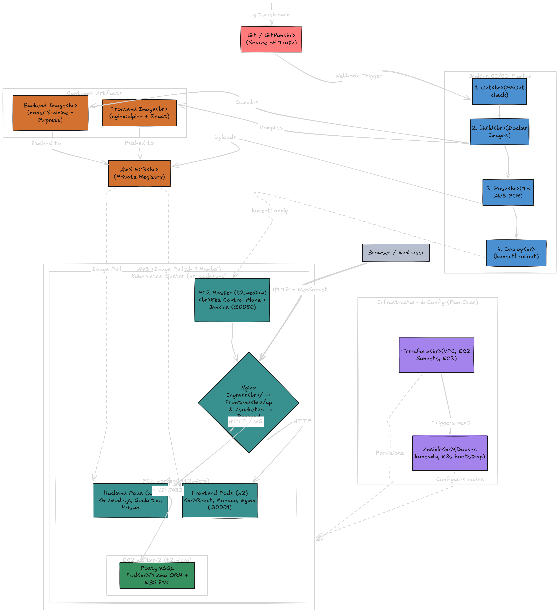

# CodeSync Cloud IDE

CodeSync is a browser-based collaborative code editor, hosted on AWS, featuring real-time syncing and an automated build/preview pipeline. Users can input a public GitHub repository, collaborate in real time using a Monaco editor, preview their running application on a dedicated port, and trigger automated builds through Jenkins upon pushing changes to GitHub.

---

## Architecture Overview

The system runs entirely on standard AWS EC2 instances within a custom-configured Kubernetes cluster (using `kubeadm`), avoiding managed orchestration services to maintain direct host process control.


### Node Responsibilities

#### 1. Control Node (codesync-control: 10.0.1.10)
- **Kubernetes Control Plane**: Manages etcd, API Server, controller manager, and scheduler.
- **CI/CD Host**: Runs a Jenkins master pod pinned via nodeSelector.
- **Database Node**: Host for PostgreSQL database storage using an EBS-backed PVC.

#### 2. Frontend Node (codesync-frontend: 10.0.1.11)
- **Landing Page**: React application served via Nginx node port 30001.
- **Monaco IDE**: React application with host volume mounts served on node port 30002.
- **User Previews**: Runs user Next.js dev server instances on port 3000 and serves static build previews via Jenkins on port 4567.

#### 3. Backend Node (codesync-backend: 10.0.1.12)
- **API Server**: Express.js application processing rooms, file structures, and SSH commands.
- **WebSockets**: Socket.io server managing real-time typing events and cursor coordinates.

---

## Infrastructure and Provisioning

### Terraform Configuration
Terraform provisions the base VPC networking and computes:
- One VPC (CIDR block 10.0.0.0/16)
- One public subnet (10.0.1.0/24)
- Three Elastic IP allocations bound to target EC2 nodes
- Security groups permitting traffic for K8s inter-node ports, HTTP NodePorts, and preview ports

### Ansible Automation
The playbooks configure the cluster nodes:
- **01-common.yml**: Configures Containerd runtime, disables swap, installs Node.js
- **02-kubeadm.yml**: Configures official Kubernetes packages
- **03-master-init.yml**: Runs control plane init and sets up Flannel network CNI
- **04-workers-join.yml**: Joins worker nodes to the cluster
- **05-label-nodes.yml**: Applies node labels for pod scheduling
- **06-deploy-pods.yml**: Installs database, backend, frontend, and Jenkins manifests

---

## User Flow and Real-Time Sync

1. **Session Start**: The user inputs their GitHub URL and username on the landing page (port 30001).
2. **Repository Cloned**: The backend SSHs into the frontend node, clones the repository to `/repos/<roomId>`, parses the directory tree, and redirects the user to the IDE page (port 30002).
3. **Collaboration**: Multiple users join with the same room code. Socket.io syncs typing modifications to the database and filesystem every 5 seconds.
4. **Instant Cursors**: Cursor coordinates are transmitted instantly across all room members without throttling.
5. **App Preview**: Clicking "Start Server" commands the backend to SSH into the frontend host and execute `npm start` directly on port 3000.

---

## Deployment Steps

All terminal commands should be executed from the root directory.

### Step 1: Provision Infrastructure
```cmd
cd terraform
terraform init
terraform apply -auto-approve
```

### Step 2: Configure Inventory
Edit `ansible/inventory.ini` to populate the new public IPs:
```ini
[control]
control-node ansible_host=YOUR_CONTROL_IP

[frontend]
frontend-node ansible_host=YOUR_FRONTEND_IP

[backend]
backend-node ansible_host=YOUR_BACKEND_IP
```

### Step 3: Run Configuration Playbooks
```cmd
cd ansible
ansible-playbook -i inventory.ini playbooks/01-common.yml
ansible-playbook -i inventory.ini playbooks/02-kubeadm.yml
ansible-playbook -i inventory.ini playbooks/03-master-init.yml
ansible-playbook -i inventory.ini playbooks/04-workers-join.yml
ansible-playbook -i inventory.ini playbooks/05-label-nodes.yml
ansible-playbook -i inventory.ini playbooks/06-deploy-pods.yml
```

### Step 4: Database Sync
```cmd
ssh -i key.pem ubuntu@YOUR_CONTROL_IP "kubectl exec -n codesync deploy/backend-deployment -- npx prisma db push"
```

---

## Port Map Reference

| Port | Access Scope | Purpose |
|---|---|---|
| 22 | Administrator | SSH Host Access |
| 30001 | Public | Landing Page |
| 30002 | Public | Monaco Collaborative IDE |
| 30003 | Public | Backend REST API & Socket server |
| 30080 | Public | Jenkins Web Console |
| 3000 | Public | Next.js running dev server preview |
| 4567 | Public | Jenkins static build server preview |
| 5432 | Internal VPC | PostgreSQL service listener |
